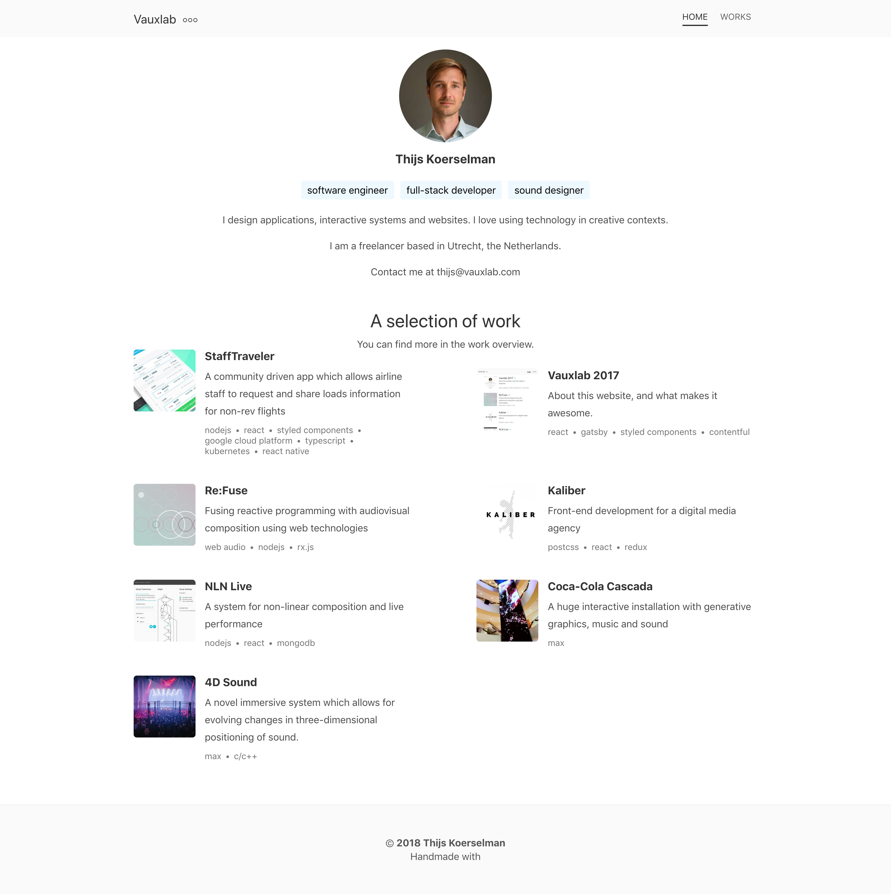

# My Resume Website
# https://selfresume-20ea2.web.app/
## selft-resume-website
用react开发的简单的个人简历网站。参考自[这个网站](https://www.vauxlab.com/)。


## 本地开发  
```js
npm start
```
## 打包构建
```
npm run build
```
## 把build文件夹上传到服务器
## 服务器为firebase或者使用`github pages`、`netlify`、`gitlab pages`免服务器免费部署。
```
firebase init
firebase deploy --only hosting
```
## 如果未出现更改删除文件后重新init
.firebaserc
firebase.json
.firebase
